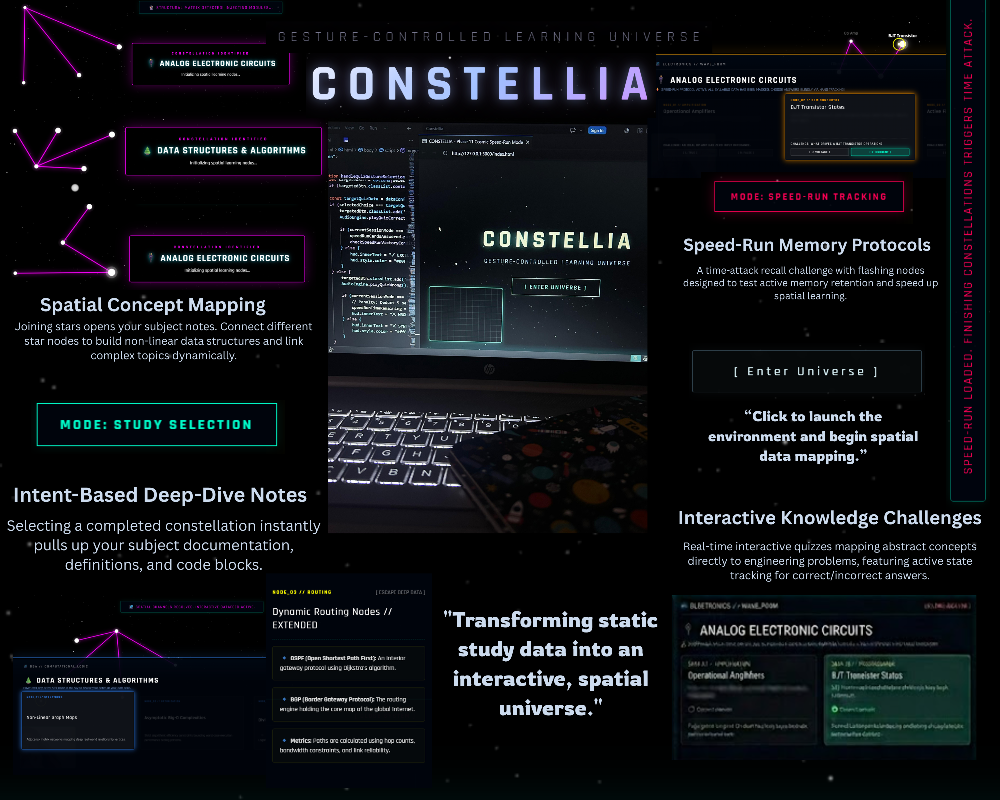

# 🌌 Constellia — Gesture-Controlled Learning Universe

> *"Transforming static study data into an interactive, spatial universe."*



---

## ✨ What is Constellia?

Constellia is a weekend experiment that reimagines how we interact with study materials. Instead of organizing notes into folders, subjects become **constellations in a visual, interactive space** — where you connect ideas the same way stars form patterns in the night sky.

It started with one question: **Can learning feel a little more visual, interactive, and immersive?**

---

## 🚀 Features

- **Spatial Concept Mapping** — Create star nodes for topics and connect them to build non-linear relationships between ideas
- **Hand Gesture Controls** — Connect and interact with nodes using real-time hand tracking via MediaPipe
- **Hover & Spatial Audio** — Hover over nodes to reveal notes with audio feedback
- **Speedrun Mode** — A timed memory challenge to test how well you've mapped your knowledge
- **Interactive Knowledge Challenges** — Real-time quizzes that map abstract concepts to engineering problems
- **Immersive Constellation UI** — A fully themed, responsive dark-space interface

---

## 🛠️ Built With

- Vanilla JavaScript, HTML5 & CSS3
- MediaPipe (browser-based hand tracking)
- Custom interactive node system
- Spatial UI/UX and knowledge visualization concepts

---

## 🖥️ How to Run

No installs. No setup. Just open and explore.

```bash
# Clone the repo
git clone https://github.com/YOUR_USERNAME/constellia.git

# Open in browser
open index.html
```

Or simply download the files and open `index.html` in any modern browser.

> **Note:** Hand gesture features require camera access. Allow it when prompted.

---

## 💡 Why I Built This

I've been fascinated by space since childhood — the idea that scattered dots could come together to form something meaningful. When I started thinking about a notes app, that image stuck with me.

Constellia isn't trying to be the next productivity tool. It's a small creative experiment in making learning feel less like a chore and more like exploration.

---

## 📁 Project Structure

```
constellia/
├── index.html       # Main app structure and logic
├── style.css        # Constellation-themed UI
└── Constellia_.png  # Preview image
```

---

*Built in a weekend. Fueled by curiosity and childhood stargazing.* 🌠
